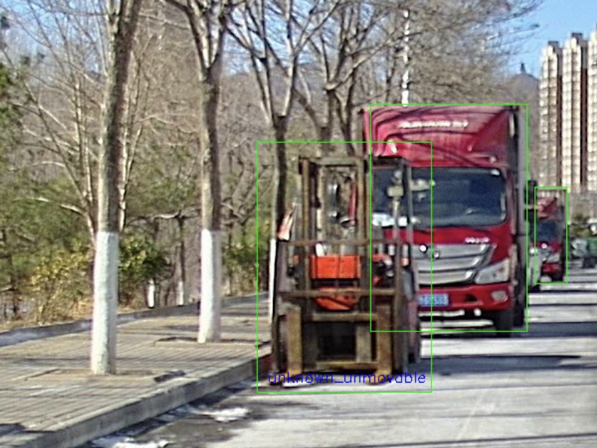

# 标注问题

1.没有截断，遮挡

2.没有输入高度

3.人的关键点顺序和位置不对

4.不能漏标，对于模型没有识别的目标，如下图人，添加tid属性，作为trackid

.png>) (1).png>)

5.行人漏标

<figure><figcaption></figcaption></figure>

6.标注的原图，不应该有任何线，如下图8点框，不应该有

.png>)

7.遮挡部分，不要框进去

8.行人6578点，没有贴合，8点立方体，正好包围目标，不要有多余空间

.png>)

'9.目标遮挡严重，超过4/5，就不用标了
